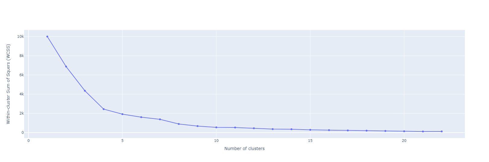
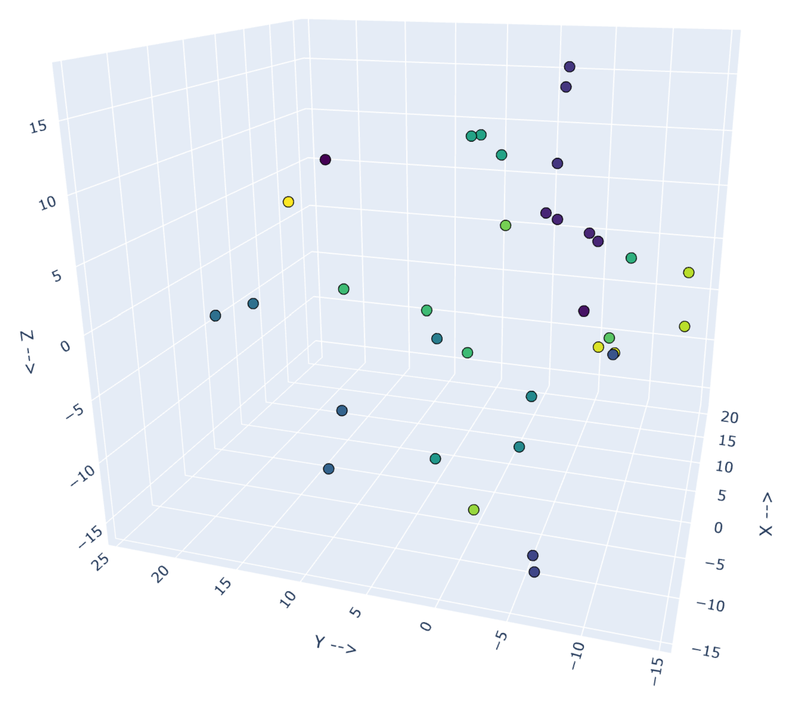

[//]: # (<style>)

[//]: # (ul.star{list-style: none;})

[//]: # (ul.star li::before{)

[//]: # (    content: "\272A";)

[//]: # (    color: orange;)

[//]: # (    font-weight: bold;)

[//]: # (    font-size: 18px;)

[//]: # (    display: inline-block; )

[//]: # (    width: 1.5em;)

[//]: # (    margin-left: 1em;)

[//]: # (})

[//]: # (</style>)

# Language Clustering

## Installs

### Install `🤗 Transformers`

Follow the instructions from the [Hugging Face website](https://huggingface.co/docs/transformers/installation).

# 2 Data Options

## *First Option:* Download English Wikipedia pages

You can either download the full Wikipedia English data or the partial data.

(we will use the partial data).

### Download Options

#### Partial Data

To download all the first 1 billion bytes of English Wikipedia, run the following command:

```
$ mkdir data
$ wget -c http://mattmahoney.net/dc/enwik9.zip -P data
$ unzip data/enwik9.zip -d data
```

#### Full Data

To download all the English Wikipedia pages, run the following command:

```
$ wget https://dumps.wikimedia.org/enwiki/latest/enwiki-latest-pages-articles.xml.bz2
```

### Pre-process Using `my-wikifil.pl`

A raw Wikipedia dump contains a lot of HTML / XML data.
We pre-process it with the wikifil.pl script
(originally developed by Matt Mahoney, we changed it a bit).

```
$ perl my-wikifil.pl data/enwik9 > data/fil9
```

### Split Sentences

The data must be split to sentences. We do it by running the scropt `split-lines.py` that saves the current input files
in the folder `split-output`.

* Make sure to update the correct input and output!

[//]: # (<ul class="star">)

[//]: # (  <li>Make sure to update the correct input and output!</li>)

[//]: # (</ul>)

## *Second Option:* NLTK Corpus

Getting all the words in the NLTK corpus.

### Download the Corpus *(First time only!)*

Make sure to uncomment `nltk.download('words')`

# Preparing The Data

The preparation of the data and saving it as a `.pkl` file.

## Generate ***WORD*** Vectors

To create ***word*** vectors from all words in the text, run the main function of either scripts `LaBSE-try.py`
***or*** `nltk_words.py` which will generate the word vectors and will save them as a `.pkl` file.

* Make sure to update the correct input and output!

[//]: # (<ul class="star">)

[//]: # (    <li>Make sure to update the correct input and output!</li>)

[//]: # (</ul>)

The object saved to the `.pkl` file will be a dictionary with words as keys, and vectors of type `numpy.ndarray` as
values.

## Dimension Reduction

Reduce the dimensionality of the vectors using the following algorithms:

* PCA
    * Make sure to update the correct input and output!
    * Choose the relevant algorithm AND dimensionality.

[//]: # (<ul class="star">)

[//]: # (    <li>Make sure to update the correct input and output!</li>)

[//]: # (    <li>Choose the relevant algorithm AND dimensionality.</li>)

[//]: # (</ul>)

# Clustering (K-means)

## Choose Number of Clusters

Using the `Elbow Method` we choose the number of clusters.

* Make sure to uncomment/comment the code line.

[//]: # (<ul class="star">)

[//]: # (    <li>Make sure to uncomment/comment the code line.</li>)

[//]: # (</ul>)

### Elbow Method 2D Plot Example of ```test1```

<p align="center">
  
</p>

## 3D Scatter Plotting

We use `plotly` so make sure to install the packege:

```
$ pip install plotly
```

### 3D Scatter Plot Example of ```test1```

<p align="center">
  
</p>

